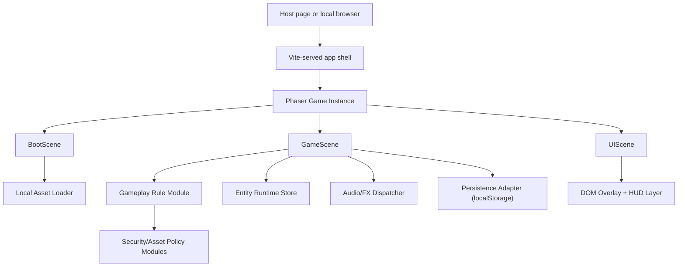
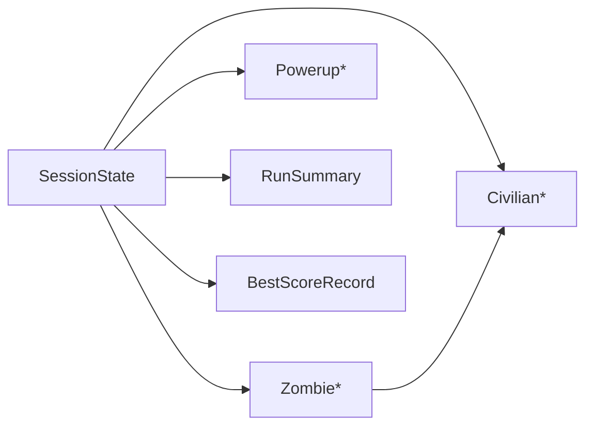

# Zombite3 System Architecture

## 1. Executive Summary
Zombite3 is a single-player embeddable browser game built as a self-contained front-end application. The architecture must upgrade the current beta toward a more professional product without introducing backend systems, authentication, cloud persistence, or third-party runtime dependencies. The design therefore centers on a deterministic Phaser 3 client runtime, static local assets, localStorage-based record persistence, and a UI/state model that remains readable inside both local and embedded containers.

Chosen core stack:
- Phaser `3.90.x` for scene orchestration, input handling, asset loading, and render loop
- Vite `5.x` for local development, production bundling, and embeddable asset serving
- JavaScript ES modules for browser-compatible game logic and modular domain rules
- Browser `localStorage` for best-score persistence
- Web Audio API / browser audio unlock flow for responsive in-session feedback

Architecture goals:
- preserve deterministic gameplay rules for shooting, overlap resolution, conversion, and score/life penalties
- keep the game runnable locally while supporting bounded embed containers such as `800x450`
- isolate gameplay rules from scene presentation so balance and UX work can evolve without uncontrolled drift
- keep runtime assets local, documented, and safe for embedded environments

## 2. System Architecture



### Components and responsibilities
- `App shell`
  - mounts the game inside the embed/local container
  - owns viewport constraints and root canvas hosting
- `BootScene`
  - loads gameplay-critical local assets
  - validates that core resources are available before play starts
- `GameScene`
  - owns gameplay loop, entity spawning, combat resolution, conversion flow, progression, and score/life state
- `UIScene`
  - owns overlays, HUD readability, player messaging, and state summaries
- `Gameplay Rule Module`
  - holds deterministic numeric rules for penalties, targeting, accuracy, and threat categories
- `Entity Runtime Store`
  - in-memory scene-owned state for civilians, zombies, power-ups, counters, and phase transitions
- `Persistence Adapter`
  - reads/writes best score through localStorage only
- `Security/Asset Policy Modules`
  - validate local asset paths and reject forbidden runtime behavior such as dynamic script execution

### FR traceability by component
- `FR-001` Fast-start embeddable session
  - App shell, BootScene, UIScene, Vite static serving
- `FR-002` Readable rescue-shooter core loop
  - GameScene, UIScene, local assets, crosshair/HUD systems
- `FR-003` Deterministic target and penalty rules
  - Gameplay Rule Module, GameScene combat pipeline
- `FR-004` Escalating pressure with three zombie categories
  - GameScene progression model, entity spawn/orchestration
- `FR-005` Scoring, level closure, and record persistence
  - GameScene state machine, UIScene summaries, Persistence Adapter
- `FR-006` Professional presentation quality baseline
  - UIScene, local art/audio assets, Web Audio feedback flow
- `FR-007` Local asset provenance and runtime safety
  - BootScene asset loading, Security/Asset Policy Modules, ASSETS.md inventory

## 3. Data Model

There is no server-side database by design. The data model is an in-memory game state plus a minimal persistent browser record.

### Runtime entities
- `SessionState`
  - `score`
  - `life`
  - `level`
  - `wave`
  - `shots`
  - `hits`
  - `kills`
  - `civiliansSaved`
  - `civiliansLost`
  - `civiliansGoal`
  - `civiliansLostLimit`
  - `accuracy`
  - `gameOver`
  - `gameOverReason`
  - `levelCompleted`
  - `levelCompleteBonus`
- `Civilian`
  - `id`
  - `lane`
  - `x`, `y`
  - `speed`
  - `hitRadius`
  - `direction`
  - `sprite refs`
  - `danger state`
- `Zombie`
  - `id`
  - `type` (`zombie`, `zombie-elite`, `zombie-brute`)
  - `lane`
  - `x`, `y`
  - `speed`
  - `hp`
  - `maxHp`
  - `targetCivilianId`
  - `sprite refs`
- `Powerup`
  - `id`
  - `type`
  - `x`, `y`
  - `speed`
  - `direction`
- `RunSummary`
  - `score`
  - `level`
  - `accuracy`
  - `civiliansSaved`
  - `civiliansLost`
  - `reason`
- `BestScoreRecord`
  - localStorage key: `zrr.highScore`
  - localStorage value: integer best score

### Persistence schema
No relational schema is required. Persistence contract is:

```text
Key: zrr.highScore
Value: stringified non-negative integer
```

### Indexes
No database indexes exist. Runtime lookups use:
- `Map<string, Entity>` for active entity references
- typed filtering helpers for active civilians/zombies/power-ups
- single-key localStorage lookup for best score

### ER-style relationship summary


## 4. API Design

There is no remote HTTP API in scope. This section defines runtime interfaces instead of backend routes.

### Public runtime interfaces
- `pointermove`
  - purpose: move crosshair
  - source: browser pointer input
  - error handling: clamp to playable viewport
- `pointerdown`
  - purpose: trigger shot
  - source: browser pointer input
  - error handling: ignore when game is not in active state
- `keydown ESC`
  - purpose: toggle pause
  - error handling: ignored during invalid states
- `keydown R`
  - purpose: restart run
  - error handling: ignored before run start
- `UI event bus`
  - `ui:start`
  - `ui:restart`
  - `ui:pause-toggle`
  - `ui:next-level`

### Internal module interfaces
- `resolveShotTarget({ crosshair, entities, hitRadius, targetPriority })`
  - returns deterministic target candidate or `null`
- `applyShotOutcome(state, target, options)`
  - applies score/life/feedback result
- `applyCivilianLostPenalty(state, lifeDamage, options)`
  - applies zombie contact and lost-civilian consequences
- `applyCivilianSaved(state, amount)`
  - increments civilian rescue state
- `evaluateSecurityControls({ assetPaths, exposeDebugEndpoints, dynamicScriptExecution })`
  - validates runtime safety policy

### Request/response model equivalent
Since no network API exists, “responses” are scene events:
- `hud:update`
- `run:state`
- `message`
- `game:over`
- `level:complete`

### Error handling strategy
- invalid input in inactive states is ignored, not processed
- missing localStorage access degrades gracefully by skipping persistence
- asset safety violations are surfaced as warnings or startup blockers depending on severity
- invalid embed/container size activates a readable guard state instead of attempting unreadable gameplay

## 5. Security Design

### Scope
Security in this product is browser runtime safety, asset provenance, and embed hardening, not identity/authentication.

### Threat model
- non-local or unsafe asset paths
- dynamic script execution in runtime
- debug/admin exposure in shipped build
- embed host constraints causing unreadable or misleading states
- undocumented asset drift from shipped runtime usage

### Controls
- local asset path validation through security policy helpers
- no runtime dependency on third-party executable scripts
- no backend or admin route surface in the product architecture
- gameplay-critical assets loaded from repository-local paths only
- asset inventory tracked via manifest + `ASSETS.md`
- embed-safe viewport guard to prevent unreadable active play in invalid containers

### Input validation
- pointer coordinates are clamped to the playfield
- keyboard actions are gated by gameplay state
- scene-driven event names are fixed and not dynamically executed
- persistence values are parsed as finite non-negative integers only

### Encryption
- not applicable; there is no authenticated or remote data flow in scope

### Auth
- intentionally absent by product design and no-go zone

## 6. Performance & Scalability

### Performance targets
- first playable state within `3s` for repeat sessions after initial asset load
- responsive input-to-feedback loop with audio start within `100ms` for unlocked audio context
- playable readability inside `800x450` and `1280x720`

### Performance strategy
- keep asset set static and local
- use pooled visuals for common transient effects where appropriate
- separate scene responsibilities to minimize HUD/gameplay coupling
- avoid runtime remote requests
- preserve deterministic in-memory state instead of over-layered abstractions

### Scalability stance
This is intentionally a single-player browser game. Horizontal scaling, distributed systems, and data replication are out of scope. The relevant notion of scalability is:
- stable play across repeated short sessions
- reliable operation inside different embed container sizes
- maintainable content extension for levels, enemies, and assets without architectural rewrite

## 7. Deployment Architecture

### Environments
- `local dev`
  - Vite dev server
  - hot iteration and QA
- `local preview`
  - Vite production preview or static hosting simulation
- `embed host`
  - static asset hosting inside a bounded web container or iframe target

### Deployment model
- static front-end bundle only
- no backend services
- no database
- no auth provider

### Container / packaging approach
- optional static-container preview for QA and reproducible local checks
- build artifacts served as static files

### CI/CD expectations
- run automated tests from repo root
- run production build
- validate asset inventory alignment
- publish static assets to hosting target

## 8. Risk Analysis

### Risk 1: Product drift between beta behavior and formal requirements
- Impact: medium-high
- Mitigation: requirements and UX spec become authoritative baseline; Phase 3 tests must map to these rules instead of legacy wording.

### Risk 2: Embed readability failure in constrained containers
- Impact: high
- Mitigation: explicit viewport guard, HUD constraints at `800x450` and `375px/768px`, UI acceptance criteria tied to bounded layouts.

### Risk 3: Asset inconsistency undermines perceived product quality
- Impact: high
- Mitigation: enforce manifest + `ASSETS.md` traceability and final-art consistency rules before release.

### Risk 4: Feedback timing degrades game feel
- Impact: medium-high
- Mitigation: keep action feedback local, lightweight, and scene-driven; test audio trigger latency and visual confirmation windows.

### Risk 5: Legacy tests continue validating the wrong behavior
- Impact: high
- Mitigation: replace or refactor generated tests so FR/AC coverage matches the new requirements baseline.

## Architectural Decision Records (ADRs)

### ADR-01: Game Engine Baseline
Context: The product is upgrading a working beta and needs professional quality without a rewrite that jeopardizes delivery.
Option A: Continue with Phaser `3.90.x` — mature scene system, input model, and asset orchestration; lower delivery risk; preserves current baseline.
Option B: Rewrite to Canvas API + vanilla JS — more direct control and lower abstraction, but higher implementation risk and loss of current momentum.
Decision: Option A — continue with Phaser `3.90.x`.
Consequences: preserves the current implementation baseline and reduces delivery risk, but keeps the project coupled to the engine abstraction.

### ADR-02: Runtime State Management
Context: Gameplay requires deterministic frame-level state transitions for combat, conversion, HUD, and progression.
Option A: Scene-owned in-memory state with modular pure rule helpers — low overhead, deterministic, aligned with a game loop.
Option B: External state container/store pattern — more formal separation, but unnecessary complexity for a single-scene browser game.
Decision: Option A — scene-owned state plus modular rule helpers.
Consequences: simpler runtime and lower latency, but strong discipline is required to prevent GameScene from becoming too large.

### ADR-03: Persistence Strategy
Context: The product needs only best-score persistence and explicitly excludes backend/cloud persistence.
Option A: localStorage singleton key — trivial to implement, aligned with no-go zone, enough for current score retention.
Option B: IndexedDB layer — more extensible, but unnecessary for a single best-score record.
Decision: Option A — localStorage.
Consequences: minimal persistence surface and low complexity, but no structured offline storage beyond simple records.

### ADR-04: Embed Delivery Model
Context: The game must be embeddable while still runnable locally.
Option A: Static bundle loaded via iframe/container-compatible front-end shell — simplest hosting model, predictable isolation.
Option B: Script-injected widget runtime with DOM ownership in host page — more flexible integration, but more layout/security complexity.
Decision: Option A — static embeddable bundle with bounded container support.
Consequences: clearer integration contract and lower host interference, but less direct host-page customization.

### ADR-05: Audio Playback Model
Context: The product needs responsive audio feedback while respecting browser autoplay constraints.
Option A: Browser-unlocked Web Audio / scene-triggered playback after first interaction — responsive and suitable for low-latency effects.
Option B: Passive HTML audio tags only — simpler, but less reliable for many short reactive SFX.
Decision: Option A — interaction-unlocked audio flow.
Consequences: better feedback timing, but requires explicit first-interaction unlock handling.

### ADR-06: Asset Safety and Provenance
Context: The product must avoid runtime remote dependencies and keep asset provenance auditable.
Option A: Repository-local asset loading with manifest and ASSETS.md validation — explicit provenance and stable runtime behavior.
Option B: Mixed local/remote asset loading — easier asset iteration, but violates runtime safety and traceability goals.
Decision: Option A — local-only gameplay-critical assets.
Consequences: stronger safety and consistency, but stricter asset pipeline discipline is required.

## Failure Blast Radius

### Component: BootScene / asset loader
- Blast radius: the game cannot reach a trustworthy playable state if critical assets fail to load.
- User impact: blank, broken, or partially rendered game shell; immediate loss of trust.
- Recovery: fail fast in local QA, surface missing asset issue, fix manifest/path mismatch before release.

### Component: Persistence adapter (localStorage)
- Blast radius: best-score persistence stops working, but core gameplay remains playable.
- User impact: score summary still works for the session, but previous high score is missing or not retained after reload.
- Recovery: degrade gracefully, continue session, skip persistence write, optionally show no blocking error.

### Component: Gameplay rule module
- Blast radius: penalties, targeting, scoring, and progression become inconsistent across the whole run.
- User impact: the game feels unfair or incoherent; acceptance criteria for deterministic play fail.
- Recovery: test-gate all rule changes, isolate pure rule helpers, and block release if rule regressions appear.

### Component: UI/HUD overlay layer
- Blast radius: player loses visibility into score, life, civilian counts, or state transitions.
- User impact: gameplay remains technically running but becomes unreadable and product quality drops sharply.
- Recovery: preserve last-known-safe HUD state, keep overlays minimal, and treat HUD regressions as release blockers.

## Traceability Checklist
- [x] Every FR-* is addressed by at least one component
- [x] Every NFR-* has a corresponding design decision
- [x] Every ADR has ≥2 options
- [x] no_go_zone items are not introduced into the architecture
- [x] Failure blast radius documented for ≥2 critical components
